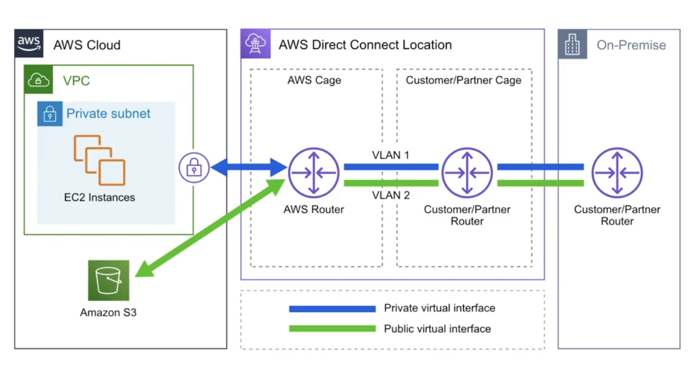

AWS DIRECT CONNECT: is a private dedicated connection Tra IL tuo ufficio/datacenter/co-location ed AWS

IT CAN HAVE 2 SPEEDS:
    1) Lower Bandwidth 50MBps to 500MBps
    2) Higher Bandwidth 1GBps to 10GBps

